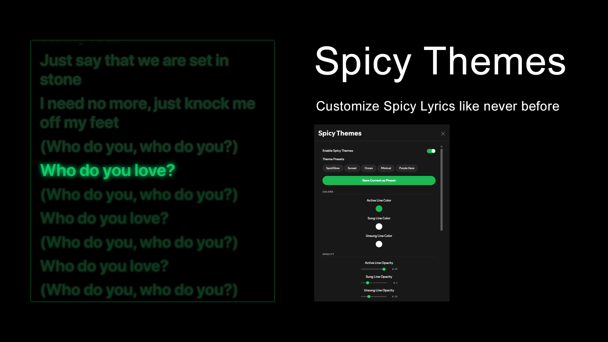

# SpicyThemes

Customize [Spicy Lyrics](https://github.com/Spikero/Spicy-Lyrics) with colors, glow effects, gradients, blur, fonts, opacity and more.



## Features

- **Color Customization** - Change active, sung, unsung and background lyric line colors
- **Opacity Control** - Fine-tune the visibility of active, sung and unsung lines independently
- **Glow Effects** - Add customizable glow with separate colors and intensity for active vs normal lines
- **Gradient Text** - Enable gradient rendering on lyrics with configurable start/end colors and angle
- **Font Options** - Change font family, weight, size, letter spacing and line height
- **Blur Effects** - Blur unsung lines with adjustable intensity for a cinematic focus effect
- **Scale Active Lines** - Enlarge the currently playing line
- **Animation Speed** - Speed up or slow down lyric transitions
- **Background Overlay** - Add a tinted color overlay behind lyrics with adjustable opacity
- **Theme Presets** - Choose from built-in presets or save your own custom themes
- **SLT Compatibility** - Style translation text from [Spicy Lyric Translator](https://github.com/7xeh/SpicyLyricTranslator) independently (color, opacity, font size)
- **Multi-Context** - Works in full page, sidebar, Cinema mode and Picture-in-Picture
- **Toggle Button** - Palette icon in the lyrics view to quickly enable/disable theming
- **Auto Updates** - Automatically updates to the latest version
- **Hide Scrollbar / Rounded Corners** - Extra UI tweaks

## Installation

### Spicetify Marketplace (Recommended)

1. Open Spotify and go to the Marketplace
2. Search for **Spicy Themes**
3. Click **Install**

### Manual Install

1. Make sure [Spicetify](https://spicetify.app/) and [Spicy Lyrics](https://github.com/Spikero/Spicy-Lyrics) are installed
2. Download the latest `spicy-themes.js` from [Releases](https://github.com/7xeh/SpicyThemes/releases)
3. Copy it to your Spicetify extensions folder:
   ```
   %APPDATA%\spicetify\Extensions\
   ```
4. Run `spicetify apply`
5. Restart Spotify

### From Source

```bash
git clone https://github.com/7xeh/SpicyThemes.git
cd SpicyThemes
npm install
npm run build
npm run deploy
```

## Usage

1. Open Spotify and navigate to the lyrics page (Spicy Lyrics)
2. Click the **palette icon** in the lyrics view controls to toggle theming
3. Go to **Settings** in Spotify to find the **Spicy Themes** section
4. Pick a preset or customize colors, effects, fonts and more
5. Right-click the palette icon to open the settings modal directly

## Configuration

All settings are available in Spotify Settings > Spicy Themes:

| Category | Settings |
|----------|----------|
| Colors | Active line, sung line, unsung line, background line |
| Opacity | Active line, sung line, unsung line |
| Glow | Enable/disable, glow color and intensity, active glow color and intensity |
| Gradient | Enable/disable, start color, end color, angle |
| Typography | Font family, font weight, font size, letter spacing, line height |
| Effects | Blur unsung lines, blur amount, scale active line, animation speed |
| Background | Page overlay toggle, overlay color, overlay opacity |
| SLT Styling | Translation color, translation opacity, translation font size |
| UI | Hide scrollbar, rounded corners |

## Presets

Built-in presets:

| Preset | Description |
|--------|-------------|
| SpotiGlow | Spotify green with vibrant neon glow and gradient |
| Sunset | Warm orange/yellow gradient tones with glow |
| Ocean | Cool blue tones with a calm gradient feel |
| Minimal | Clean default look, subtle and easy on the eyes |
| Purple Haze | Deep purple vibes with glow and gradient |

You can also save and manage your own custom presets.

## Compatibility

- Requires [Spicy Lyrics](https://github.com/Spikero/Spicy-Lyrics)
- Works alongside [Spicy Lyric Translator](https://github.com/7xeh/SpicyLyricTranslator) with dedicated translation styling
- Supports all Spicy Lyrics view modes: full page, sidebar, Cinema and PiP

## License

MIT